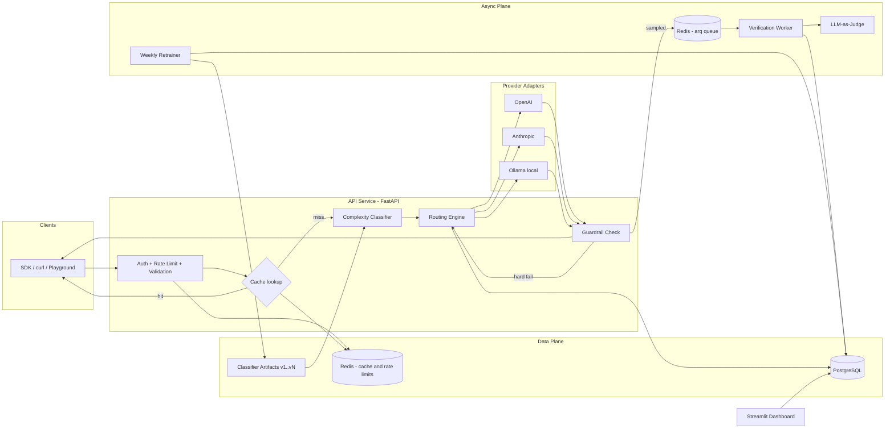
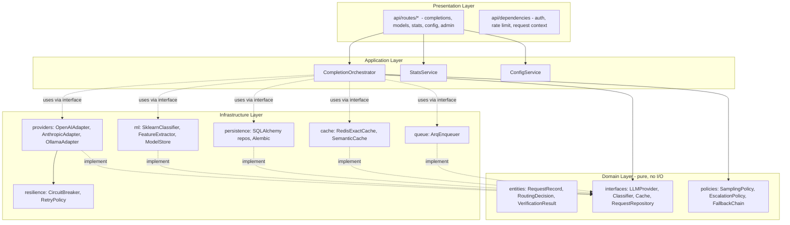
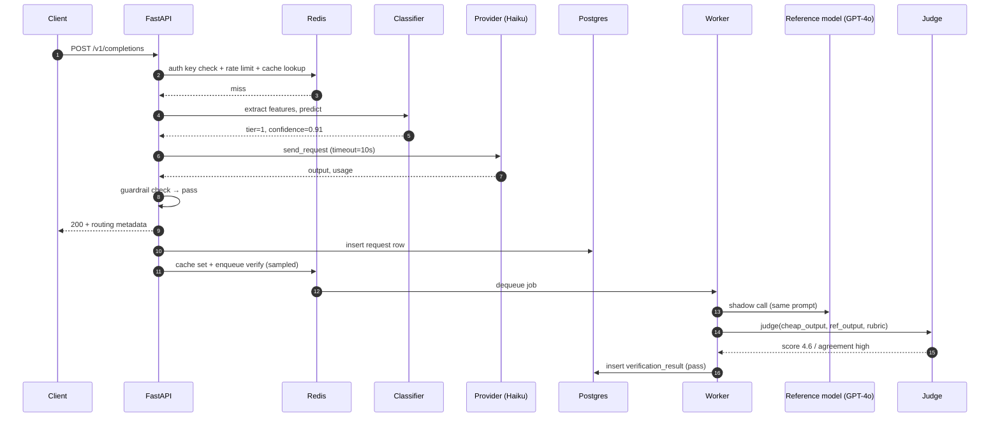
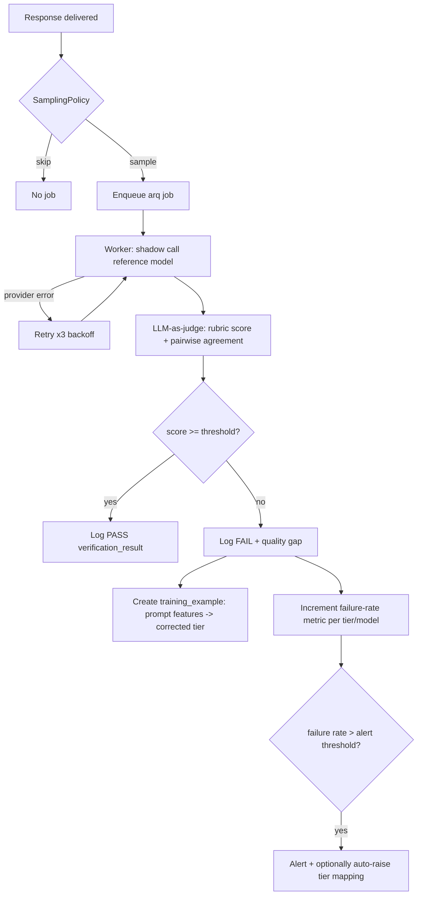
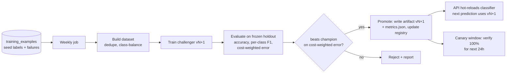
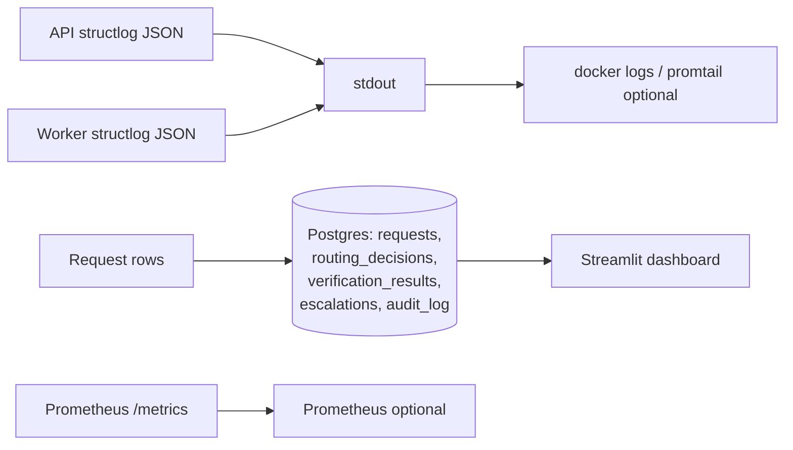

# 02 — System Architecture & Diagrams

All diagrams are Mermaid; they render on GitHub and in most IDEs.

## 1. High-level architecture

**Services (containers):** `api` (FastAPI), `worker` (arq), `retrainer` (cron-style job, can share worker image), `postgres`, `redis`, `ollama`, `dashboard` (Streamlit).

## 2. Component architecture (inside the API service)

Dependency rule: **presentation → application → domain ← infrastructure**. The domain layer imports nothing from the outer layers; infrastructure implements domain interfaces (ports & adapters).

## 3. Request lifecycle

1. **Ingress** — request hits `POST /v1/completions`; middleware assigns `request_id` (UUIDv7), resolves API key → tenant, checks token-bucket rate limit in Redis (`429` on exceed), validates body via Pydantic (`422` on failure), enforces max prompt size.
2. **Cache** — normalized prompt+params hashed; exact-match Redis lookup. Hit → return cached response with `"cached": true` metadata, log a zero-cost row, done (~2 ms).
3. **Classification** — FeatureExtractor computes features (<1 ms); versioned sklearn classifier returns `(tier, confidence)`. If `confidence < τ` (default 0.6), bump one tier and flag `low_confidence=true`.
4. **Routing** — RoutingEngine reads the active tier→model map; skips models whose circuit breaker is open; produces an ordered candidate list `[primary, fallback1, fallback2]`.
5. **Execution** — provider adapter called with per-tier timeout; retryable errors (429/5xx/timeout) retried with exponential backoff + jitter (max 2); on exhaustion, next candidate in the fallback chain; breaker records outcome.
6. **Guardrails (sync)** — cheap checks on the output: empty, refusal pattern, truncated (`finish_reason=length`), requested-format violation. Hard failure → immediate synchronous escalation to next tier (once), `escalated=true`.
7. **Response** — standardized payload + `routing` metadata block (model, tier, confidence, cost, latency, cache/escalation flags) returned to the client. Total added overhead budget: **< 10 ms** over the raw provider call.
8. **Persistence & enqueue (post-response)** — request row written to Postgres; SamplingPolicy decides whether to enqueue a verification job in arq (see §5).
9. **Verification (async)** — worker shadow-calls the reference model, runs LLM-as-judge, writes `verification_results`; failures create `training_examples`.
10. **Learning (weekly)** — retrainer builds a dataset from labels + accumulated failures, trains a challenger, evaluates vs champion on frozen holdout, promotes or rejects, bumps classifier version.

## 4. Sequence diagram — happy path + async verification

## 5. Async verification flow (with failure branch)

Sampling policy: `P(verify) = 1.0` if `low_confidence` or inside canary window (config/classifier changed < N hours ago), else `base_rate` (default 0.10). Daily verification budget cap in USD; when exhausted, only low-confidence requests are verified.

## 6. Feedback / retraining pipeline

## 7. Logging pipeline

Every log line and DB row carries `request_id`; the worker receives it inside the job payload so one grep or one SQL query reconstructs the full lifecycle of any request.

## 8. Data flow summary

| Data | Producer | Store | Consumer |
|---|---|---|---|
| Request/response metadata | API | Postgres `requests` | Dashboard, stats API |
| Routing decision + classifier version | Router | `routing_decisions` | Retrainer, dashboard |
| Verification scores | Worker | `verification_results` | Dashboard, alerting, retrainer |
| Training examples | Worker + seed set | `training_examples` | Weekly retrainer |
| Classifier artifacts | Retrainer | volume `artifacts/` + `classifier_versions` | API classifier |
| Cache entries | API | Redis (TTL) | API |
| Rate-limit counters | Middleware | Redis | Middleware |
| Config (tier→model map) | Admin API | `routing_configs` (versioned rows) | Router |
