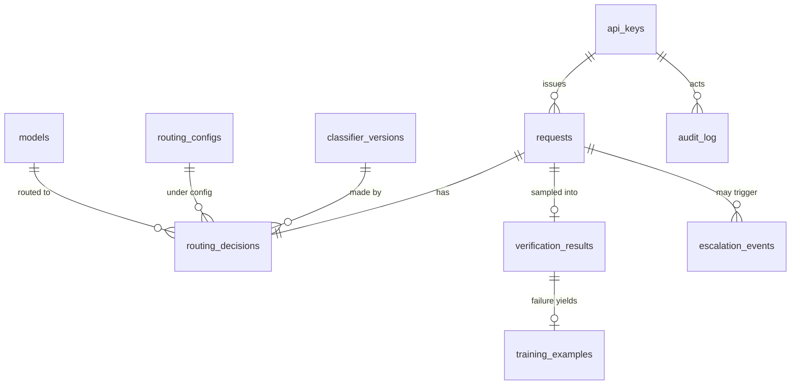

# 04 — Database Schema

Target: **PostgreSQL 16** (production/Docker) and **SQLite** (zero-dependency local dev) through SQLAlchemy 2.0 + Alembic. Types below are Postgres; the ORM maps JSONB→JSON and UUID→TEXT transparently on SQLite.

## 1. Entity-relationship overview



## 2. Tables

### `models` — model registry (mirror of models.yaml, DB-authoritative after boot)
| Column | Type | Notes |
|---|---|---|
| id | TEXT PK | e.g. `openai:gpt-4o-mini` |
| provider | TEXT NOT NULL | enum: openai/anthropic/ollama |
| model_name | TEXT NOT NULL | vendor model id |
| input_cost_per_mtok | NUMERIC(10,4) | USD per 1M input tokens |
| output_cost_per_mtok | NUMERIC(10,4) | |
| quality_tier | SMALLINT | 1–3 capability ceiling |
| max_context | INT | |
| avg_latency_ms | INT | rolling, updated nightly |
| is_active | BOOLEAN DEFAULT true | soft-disable without delete |
| created_at / updated_at | TIMESTAMPTZ | |

### `api_keys`
| Column | Type | Notes |
|---|---|---|
| id | UUID PK | |
| key_hash | TEXT UNIQUE NOT NULL | SHA-256; raw key shown once |
| key_prefix | TEXT NOT NULL | `lca_live_ab12` for identification |
| name | TEXT | |
| rate_limit_rpm | INT DEFAULT 60 | |
| store_prompts | BOOLEAN DEFAULT false | privacy policy per key |
| is_active | BOOLEAN DEFAULT true | |
| created_at / last_used_at | TIMESTAMPTZ | |

### `requests` — one row per API call (the audit trail)
| Column | Type | Notes |
|---|---|---|
| id | UUID PK | UUIDv7 (time-ordered → index-friendly) |
| api_key_id | UUID FK → api_keys | |
| created_at | TIMESTAMPTZ NOT NULL | |
| prompt_hash | TEXT NOT NULL | SHA-256 of normalized prompt |
| prompt_text | TEXT NULL | only if key.store_prompts |
| prompt_features | JSONB NOT NULL | extracted feature vector (needed for retraining even without raw prompt) |
| status | TEXT | ok / error / rate_limited |
| cache_hit | BOOLEAN DEFAULT false | |
| input_tokens / output_tokens | INT | |
| cost_usd | NUMERIC(12,8) | actual |
| baseline_cost_usd | NUMERIC(12,8) | counterfactual premium-model cost |
| latency_ms | INT | end-to-end |
| provider_latency_ms | INT | provider call only |
| error_type | TEXT NULL | |

### `routing_decisions`
| Column | Type | Notes |
|---|---|---|
| request_id | UUID PK FK → requests | 1:1 |
| predicted_tier | SMALLINT | raw classifier output |
| effective_tier | SMALLINT | after confidence bump |
| confidence | REAL | |
| class_probs | JSONB | per-tier probabilities |
| classifier_version_id | INT FK → classifier_versions | reproducibility |
| routing_config_id | INT FK → routing_configs | which map was live |
| model_id | TEXT FK → models | model actually used |
| fallback_depth | SMALLINT DEFAULT 0 | 0=primary, 1=first fallback… |
| decided_at | TIMESTAMPTZ | |

### `verification_results`
| Column | Type | Notes |
|---|---|---|
| id | UUID PK | |
| request_id | UUID FK → requests UNIQUE | |
| sampled_reason | TEXT | low_confidence / random / canary |
| reference_model_id | TEXT FK → models | |
| judge_model_id | TEXT FK → models | |
| judge_score | REAL | 1–5 rubric score |
| agreement | REAL | 0–1 pairwise agreement |
| verdict | TEXT | pass / fail / judge_error |
| quality_gap | REAL NULL | ref_score − candidate_score |
| shadow_cost_usd | NUMERIC(12,8) | verification spend tracked |
| judge_rationale | TEXT | required justification |
| created_at | TIMESTAMPTZ | |

### `escalation_events`
| Column | Type | Notes |
|---|---|---|
| id | UUID PK | |
| request_id | UUID FK → requests | |
| kind | TEXT | sync_guardrail / async_flagged |
| trigger | TEXT | empty_output / refusal / truncation / format_violation / verifier_fail |
| from_model_id / to_model_id | TEXT FK → models | |
| cost_delta_usd | NUMERIC(12,8) | |
| created_at | TIMESTAMPTZ | |

### `training_examples`
| Column | Type | Notes |
|---|---|---|
| id | UUID PK | |
| source | TEXT | seed / verification_failure / manual |
| prompt_hash | TEXT | dedupe key |
| features | JSONB NOT NULL | |
| label_tier | SMALLINT NOT NULL | corrected tier |
| origin_request_id | UUID NULL FK | provenance |
| is_holdout | BOOLEAN DEFAULT false | frozen eval rows never trained |
| created_at | TIMESTAMPTZ | |

### `classifier_versions`
| Column | Type | Notes |
|---|---|---|
| id | SERIAL PK | |
| version_tag | TEXT UNIQUE | `v3` |
| artifact_path | TEXT | volume path to joblib |
| trained_at | TIMESTAMPTZ | |
| train_size / holdout_size | INT | |
| metrics | JSONB | accuracy, per-class F1, cost-weighted error, confusion matrix |
| status | TEXT | candidate / active / rejected / retired |
| promoted_at | TIMESTAMPTZ NULL | |

### `routing_configs` — versioned tier→model maps
| Column | Type | Notes |
|---|---|---|
| id | SERIAL PK | |
| config | JSONB NOT NULL | `{tiers: {1: {primary, fallbacks[]}, …}, sampling: {...}}` |
| is_active | BOOLEAN | exactly one active (partial unique index) |
| created_by | TEXT | api key prefix or "seed" |
| comment | TEXT | change reason |
| created_at | TIMESTAMPTZ | |

### `audit_log`
| Column | Type | Notes |
|---|---|---|
| id | BIGSERIAL PK | |
| actor | TEXT | key prefix / system |
| action | TEXT | config_update / key_created / retrain_promoted … |
| detail | JSONB | before/after diff |
| created_at | TIMESTAMPTZ | |

## 3. Indexes

```sql
-- time-series queries (dashboard is 90% of reads)
CREATE INDEX idx_requests_created_at        ON requests (created_at DESC);
CREATE INDEX idx_requests_key_created       ON requests (api_key_id, created_at DESC);
CREATE INDEX idx_requests_prompt_hash       ON requests (prompt_hash);
CREATE INDEX idx_decisions_model_time       ON routing_decisions (model_id, decided_at DESC);
CREATE INDEX idx_decisions_clsver           ON routing_decisions (classifier_version_id);
CREATE INDEX idx_verif_verdict_time         ON verification_results (verdict, created_at DESC);
CREATE INDEX idx_escalations_time           ON escalation_events (created_at DESC);
CREATE INDEX idx_training_dedupe            ON training_examples (prompt_hash, label_tier);
CREATE UNIQUE INDEX one_active_config       ON routing_configs (is_active) WHERE is_active;
```

Notes: UUIDv7 PKs keep `requests` inserts append-only (no random-UUID index bloat). Dashboard aggregates hit `created_at DESC` indexes; JSONB columns are read whole, so no GIN indexes needed in V1 (add `GIN (prompt_features)` only if feature-level analytics arrive).

## 4. Migrations (Alembic)

- `0001_initial` — all tables above + indexes.
- `0002_seed` — data migration: import models.yaml + routing.yaml, create dev API key (hash of env-provided key).
- Policy: additive migrations only during the project; destructive changes require a paired down-revision; CI runs `alembic upgrade head` against both Postgres and SQLite to guarantee dual-dialect compatibility.

## 5. Scalability considerations (interview talking points)

1. **Partitioning path** — `requests` is the growth table; at ~10M rows switch to monthly `PARTITION BY RANGE (created_at)`; UUIDv7 + created_at make this a metadata-only change for the app.
2. **Hot aggregates** — dashboard queries currently aggregate raw rows; the upgrade is a nightly rollup table (`daily_stats`) or TimescaleDB continuous aggregates — schema already isolates reads in `data.py` so only the query layer changes.
3. **Read/write split** — dashboard is read-only by design; point it at a replica with a connection-string change.
4. **Prompt storage** — `prompt_text` nullable + per-key policy keeps PII risk and table width down; features JSONB preserves retraining ability without raw text.
5. **Queue is not in the DB** — verification jobs live in Redis/arq, so the DB never becomes a poll-based job table (a classic scaling trap).
