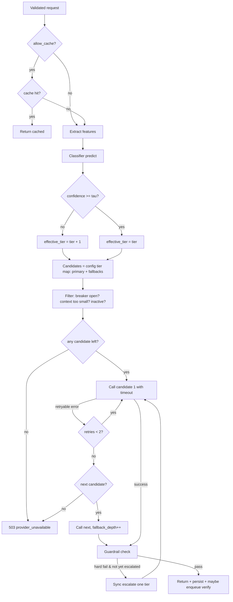

# 06 — Routing Engine & Classifier Pipeline

## Part A — Routing Engine

### A1. Model registry

`configs/models.yaml` → imported to the `models` table at boot (DB-authoritative thereafter). Each entry: provider, vendor model id, input/output cost per Mtok, quality tier ceiling, max context, expected latency. Pricing values are data, not code — updating prices is a config change plus audit row. The registry object in memory exposes `by_tier(tier)`, `get(id)`, `cheapest(tier)` and is refreshed on config change events (Redis pub/sub `config_changed` channel).

Illustrative registry (verify current prices at build time):

| id | tier | in $/Mtok | out $/Mtok | role |
|---|---|---|---|---|
| ollama:llama3.1-8b | 1 | 0 | 0 | free local floor |
| anthropic:claude-haiku | 1 | 0.80 | 4.00 | fast cheap cloud |
| openai:gpt-4o-mini | 2 | 0.15 | 0.60 | mid workhorse |
| anthropic:claude-sonnet | 2–3 | 3.00 | 15.00 | strong mid/high |
| openai:gpt-4o | 3 | 2.50 | 10.00 | reference/premium |

### A2. Complexity scoring → tier (summary; full classifier in Part B)

`FeatureExtractor.extract()` → `Classifier.predict()` → `(tier, confidence, probs)`. Routing applies two adjustments: **confidence bump** — if `confidence < τ` (config, default 0.6), effective_tier = predicted_tier + 1 (capped at 3); rationale: mis-routing up wastes cents, mis-routing down damages quality. **Context guard** — if prompt tokens exceed a candidate model's max context, skip it regardless of tier.

### A3. Decision flowchart

### A4. Resilience mechanics

**Timeouts.** Per-tier budgets (config): Tier 1 → 10 s, Tier 2 → 20 s, Tier 3 → 45 s; connect timeout 3 s everywhere. Enforced via httpx timeout objects inside adapters.

**Retries.** Only on `ProviderTimeout`, `ProviderRateLimited`, `ProviderServerError`. Max 2 retries, exponential backoff `base 0.5 s × 2^n` + full jitter; honor `Retry-After` if the provider sends it. Never retry `ProviderBadRequest` (a 400 will 400 again).

**Circuit breaker.** One breaker per model id. Closed → Open when ≥5 failures AND failure rate ≥50% in a rolling 30 s window. Open → Half-open after 20 s cooldown; half-open admits 1 probe request; success closes, failure re-opens. State kept in Redis so API replicas share it; exposed in `/v1/models` and on the dashboard.

**Fallback chain.** Ordered per tier from routing config. Depth recorded in `routing_decisions.fallback_depth`. If the chain crosses providers (recommended), a full OpenAI outage degrades to Anthropic transparently — this is the resilience story for interviews.

### A5. Caching

**Exact cache:** key = SHA-256(normalized messages + max_tokens + temperature-bucket + model-map-version); TTL 1 h (config); only `temperature ≤ 0.3` responses cached (determinism proxy), and only `finish_reason=stop` successes. Cache hits log a `requests` row with `cache_hit=true, cost_usd=0` so savings attribution is visible.
**Semantic cache (flagged, default off):** embed prompt (local MiniLM via sentence-transformers), Redis vector search, serve if cosine ≥ 0.97 AND same task_type. Off by default because false-positive serving is worse than a cache miss; turning it on is a documented experiment.

### A6. Rate limiting

Token bucket per API key in Redis (Lua script for atomicity): capacity = `rate_limit_rpm`, refill continuous. Also a global concurrency semaphore per provider (protects your provider-side quotas). 429s return `Retry-After` and standard `X-RateLimit-*` headers.

---

## Part B — Classifier Pipeline

### B1. Feature engineering

All features computable in <1 ms without any model call:

| Group | Features |
|---|---|
| Size | token_count (tiktoken), char/word count, avg sentence length |
| Instructional | counts of imperative verbs by bucket — simple (list, extract, format, translate) vs analytic (analyze, compare, evaluate, critique, design); question count |
| Constraints | number of explicit constraints ("must", "at least", "exactly", numbered requirements), requested output length |
| Structure | has_provided_context (docs/code blocks present), context_to_instruction ratio, code fence count, json/xml/table format requested |
| Reasoning markers | "step by step", "explain why", "trade-offs", multi-part ("and then", "; then"), math notation |
| Meta | task_type (client hint, one-hot), message count, has_system_prompt |

Vector serialized to `prompt_features` JSONB on every request → retraining never needs raw prompts.

### B2. Dataset

`data/seed_prompts.jsonl`, one object per line: `{"prompt": …, "task_type": …, "tier": 1|2|3, "source": "seed"}`. 200+ hand-labeled seeds; class balance target 40/35/25 (mirrors real traffic skew toward simple requests). 20% stratified split frozen into `data/holdout.jsonl` and flagged `is_holdout=true` in DB — **never trained on, ever**; this is the champion/challenger yardstick. Verification failures append rows with `source="verification_failure"` where `label_tier` = the tier that would have handled it (from quality-gap analysis: fail at tier N ⇒ label N+1).

### B3. Preprocessing & model

Pipeline: `FeatureExtractor → DictVectorizer → StandardScaler (numeric) → LogisticRegression(multinomial, class_weight="balanced")`. Random forest as a tracked alternative; keep whichever wins cost-weighted error. Deliberately no embeddings/transformers in V1 — the router must add ~0 latency, and an explainable linear model with a real feedback loop beats an opaque model without one. (V2 option documented: distilled MiniLM classifier behind the same `ComplexityClassifier` port.)

### B4. Evaluation metrics

- Accuracy (sanity only) and per-class precision/recall/F1 + confusion matrix.
- **Cost-weighted error** (headline metric): each misclassification costs `W[true][pred]` where under-routing (3→1) = 10, (3→2) = 6, (2→1) = 4, and over-routing = the actual dollar delta between tiers (~1). Report as expected weighted cost per 1,000 requests.
- Calibration curve for confidence (the τ bump only works if probabilities are honest; apply `CalibratedClassifierCV` if Brier score is poor).
- Gate for promotion: challenger must beat champion on cost-weighted error on the frozen holdout AND not regress Tier-3 recall by >2 pts.

### B5. Retraining strategy & versioning

Weekly arq cron (`weekly_retrain`), also triggerable via `POST /v1/admin/retrain`:

1. Pull `training_examples` (seed + accumulated failures), dedupe on `(prompt_hash, label_tier)`, rebalance via class weights.
2. Train challenger; evaluate on frozen holdout; write `classifier_versions` row (`status=candidate`) with full metrics JSON.
3. Auto-promote iff gate passes → `status=active`, artifact saved to `artifacts/classifier/v{n}/model.joblib`, Redis pub/sub `classifier_changed` → API hot-reloads (model store swaps atomically; in-flight predictions finish on the old version).
4. Post-promotion canary: verification sampling → 100% for 24 h; if failure rate rises >1.5× baseline, auto-rollback to previous version (`status=retired` on the bad one) + alert.
5. Every routing decision stores `classifier_version_id` — full reproducibility of any historical decision.

Cold start: before v1 exists (or if artifact load fails), a `HeuristicClassifier` (token count + reasoning-marker rules) serves predictions with fixed confidence 0.5 — which, via the τ bump, deliberately routes conservatively.
