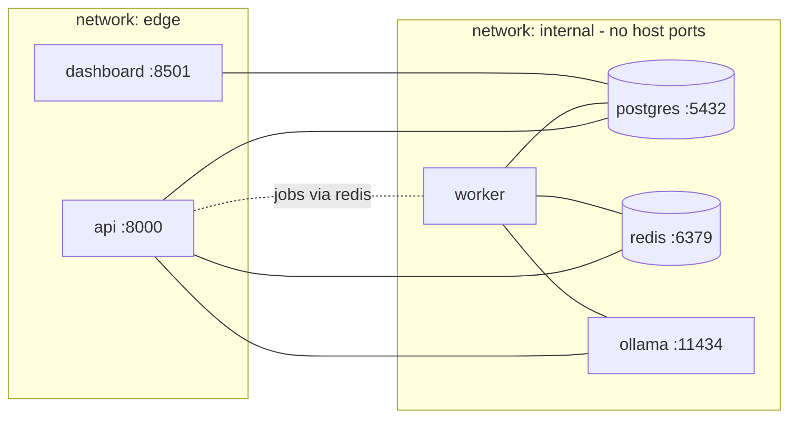

# 09 — Docker & Deployment Architecture

## 1. Service topology (docker-compose)

| Service | Image / build | Depends on | Health check | Notes |
|---|---|---|---|---|
| api | `Dockerfile` target `api` (multi-stage, python:3.11-slim, non-root) | postgres (healthy), redis | `GET /health` | runs `alembic upgrade head` via entrypoint before uvicorn |
| worker | same image, target `worker` (arq) | postgres, redis, ollama | arq check cmd | horizontal scale: `--scale worker=2` |
| dashboard | `dashboard/Dockerfile` | postgres | HTTP 8501 `/healthz` | read-only DB creds |
| postgres | `postgres:16-alpine` | — | `pg_isready` | volume `pgdata` |
| redis | `redis:7-alpine` + AOF | — | `redis-cli ping` | AOF so queued jobs survive restarts |
| ollama | `ollama/ollama` | — | tags endpoint | volume `ollama_models`; one-shot `ollama-init` service pulls llama3.1:8b |

Communication: API/worker → Postgres (asyncpg), → Redis (cache, rate limits, breaker state, arq queue, pub/sub config events), → Ollama (HTTP) and cloud providers (egress). Dashboard only reads Postgres — it never talks to the API or Redis, keeping it stateless and safe. Only `api:8000` and `dashboard:8501` are published to the host; databases stay on the internal network. Secrets via `.env` (compose `env_file`), never baked into images. `docker-compose.prod.yml` overlay adds resource limits, `restart: always`, log rotation (json-file max-size), and the optional observability profile (prometheus, grafana, jaeger).

One image, two targets: api and worker share dependencies and the `src/autopilot` package, so a single multi-stage Dockerfile with distinct CMD targets avoids drift. Local Llama means the demo runs (Tier 1) with zero cloud keys — good for reviewers cloning the repo.

## 2. Environments

### Local development (no Docker)
`uv sync` → SQLite + fakeredis (or a single `docker run redis`) + Ollama desktop; `make dev` runs uvicorn --reload, arq worker, and streamlit concurrently (honcho/Procfile). SQLite mode auto-disables multi-writer features gracefully (verification runs inline instead of queued) — documented dev-mode tradeoff.

### Docker Compose (the canonical demo)
`make up` → full stack; `make seed` loads seed prompts + dev key; `make loadtest` produces the portfolio numbers. README quickstart is exactly three commands.

### Railway (recommended cheap cloud)
Services: api, worker, dashboard from the same repo (watch paths), plus Railway Postgres and Redis plugins. Ollama is dropped (no GPU/persistent local models) — routing config's Tier 1 primary becomes claude-haiku via a `RAILWAY` env-specific routing seed. Domains: api + dashboard get public URLs; env groups share secrets.

### Render
Blueprint (`render.yaml`): web service (api), background worker, web service (dashboard), managed Postgres, Key Value (Redis-compatible). Same Ollama caveat. Free-tier spin-down is acceptable for a portfolio (note cold starts in README).

### AWS (documented reference architecture, not required to deploy)
ECS Fargate services (api ×2 behind ALB, worker ×1, dashboard ×1) · RDS Postgres · ElastiCache Redis · ECR images · Secrets Manager for provider keys · CloudWatch logs (structlog JSON parses natively) · optional GPU EC2/ECS capacity provider if keeping Ollama. IaC: a small Terraform module sketch in `deploy/aws/` (interview gold even if not applied).

### GCP
Cloud Run (api, dashboard; worker as Cloud Run job or always-on service) · Cloud SQL Postgres (via connector) · Memorystore Redis (needs Serverless VPC access) · Artifact Registry · Secret Manager · Cloud Scheduler hits `/v1/admin/retrain` weekly (replacing arq cron in serverless mode).

### Azure
Azure Container Apps (api, worker, dashboard in one environment; KEDA-scaled worker on Redis queue length — a nice detail) · Azure Database for PostgreSQL Flexible · Azure Cache for Redis · Key Vault + managed identity for secrets · Log Analytics for JSON logs.

## 3. Portability principles that make all six targets work

1. **12-factor config:** every environment difference is an env var (`DATABASE_URL`, `REDIS_URL`, `OLLAMA_URL` optional, `ROUTING_SEED` profile). No code branches per platform.
2. **Migrations on boot** with a Postgres advisory lock so N api replicas don't race `alembic upgrade`.
3. **Graceful shutdown:** SIGTERM → stop accepting, drain in-flight (uvicorn), worker finishes current job then exits — required for Fargate/Cloud Run/Container Apps rolling deploys.
4. **Statelessness:** the only stateful things are Postgres, Redis, and the classifier artifact volume; artifact store abstracts local path vs. S3/GCS/Blob (env-selected) so cloud deploys don't need shared disks.
5. **Health endpoints** (`/health`, `/healthz`) drive every platform's probes identically.

## 4. CI/CD sketch (GitHub Actions)

`lint (ruff, mypy) → unit → integration (services: postgres, redis) → build multi-stage image → push GHCR → deploy hook (Railway/Render auto-deploy on main)`. Load test job is manual-trigger. Badge row in README.
